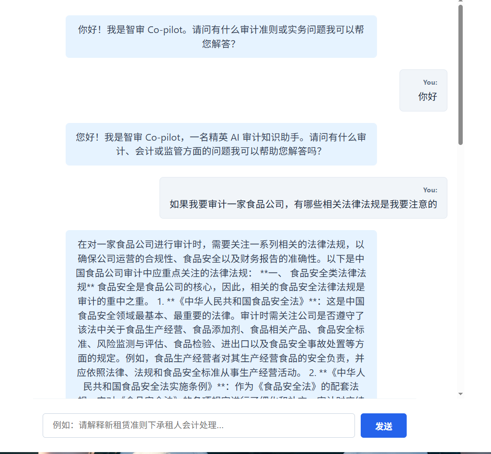
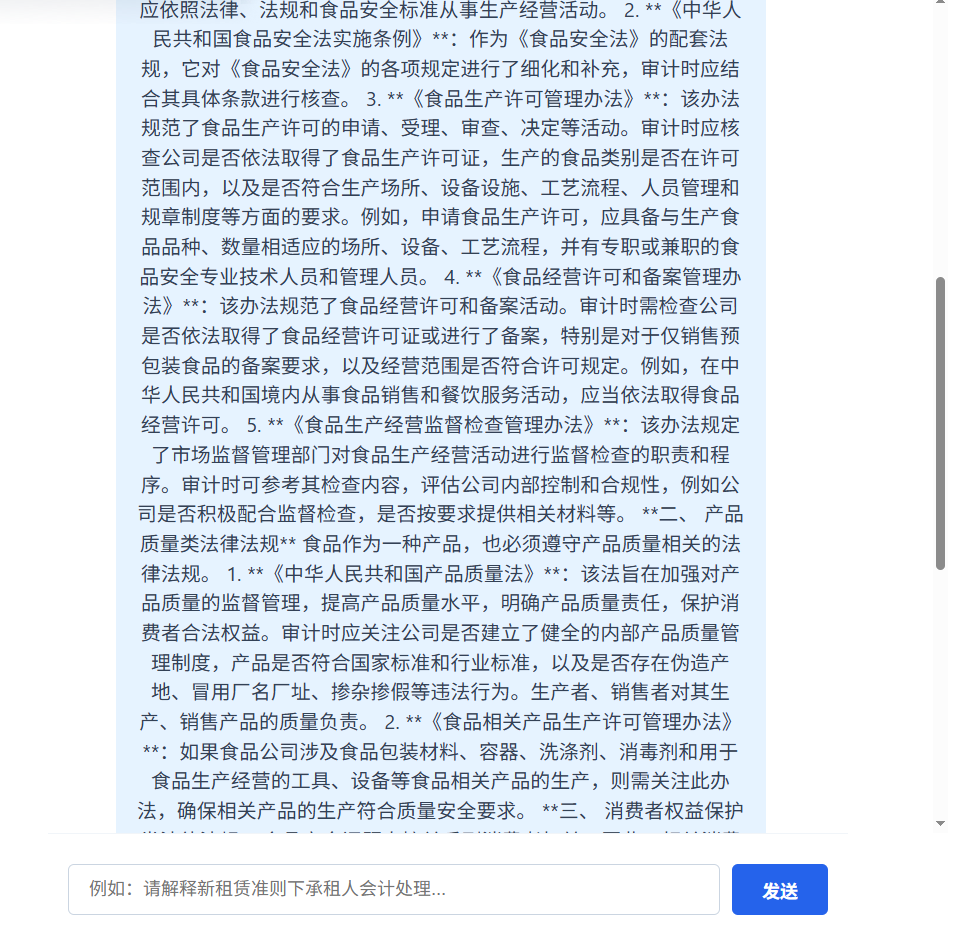
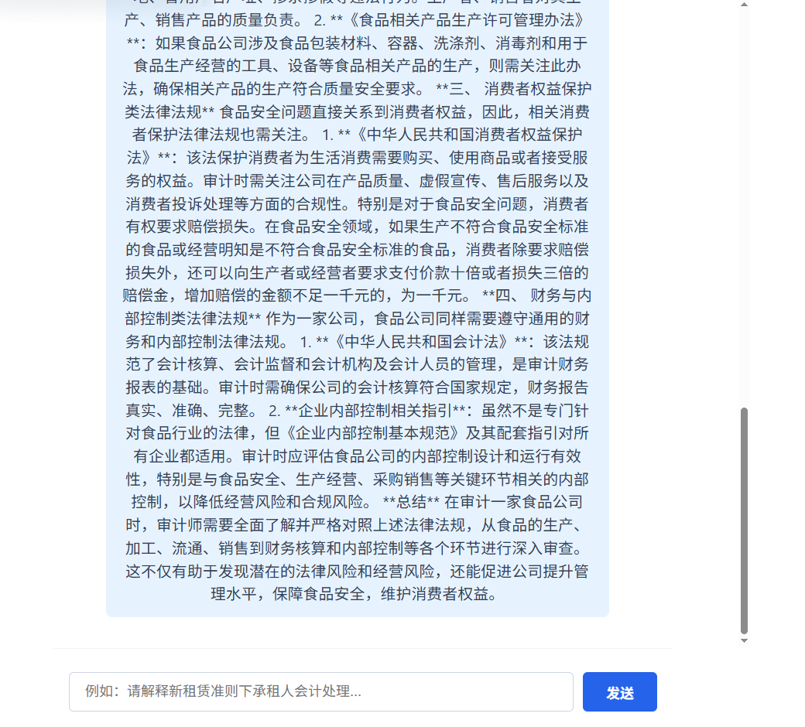

Here is the link of the website: https://storage.googleapis.com/copilot_website/index.html
Since the project was developed under the free trail of GCP and now it has run out of credits, I disabled the billing so some functions may not be available.

# AI Audit Assistant
Audit Co-pilot is an AI-powered knowledge assistant for auditors, accounting students, and internal audit teams. Leveraging large language models (LLMs) and multimodal AI, it integrates intelligent Q&A, multimodal content generation, and audit simulation into a unified platform. The system helps users efficiently acquire auditing knowledge, develop practical skills, and improve audit quality and productivity by addressing fragmented learning resources and the lack of real-world training. The product was developed in the language of simplified Chinese, and related regulation suggestions are all based on Chinese laws.
## Tech Stack
- Google Cloud as platform
- React.js
- Python + FastAPI 
- Dialogflow Conversational Agent + Vertex AI 
- Cloud Run + Cloud Storage Bucket
- PostgreSQL
## Showcase

